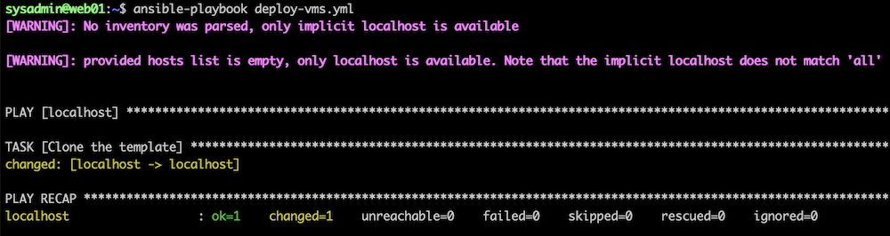
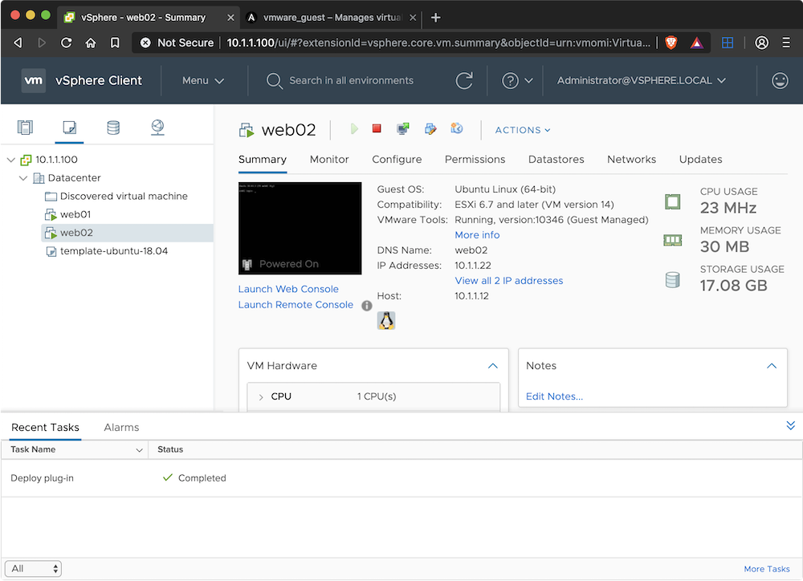
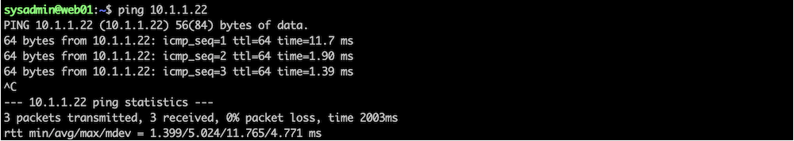

# VM-Vsphere-Ansible

This guide explains how to install Ansible and create a playbook to automate the deployment and configuration of VMs running on VMware vSphere 6.5
The following steps were tested on a MacBook Pro running VMware vSphere 6.5 on VMware Fusion 11.5. Ansible was installed on the Mac but the instructions
should also work on Linux.

### Install Ansible and pyVmomi
Python should already be installed on Mac but you might need to install pip by running this command.

`sudo easy_install pip`

Once pip is installed, we can use it to install Ansible with the following command.

`sudo pip install ansible`

We also need to install **pyVmomi** which is the **Python SDK for the VMware vSphere API** that allows you to manage ESX, ESXi, and vCenter.

`sudo pip install pyvmomi`

### Create Ansible Playbook
Ansible playbooks are YAML configuratiom files that describe what actions to run on a remote host. For this example, we’ll create a simple playbook called deploy-vms.yml that will use the **vmware_guest** module to deply a VM from template.

> The playbook above will create a new VM called web02 and place it on a datastore called iscsi-datastore01. It will be cloned from a template called template-ubuntu-18.04.

### Run the playbook
After making the required changes to the [**deploy-vms.yml**](deploy-vms.yml) file, save it, then run the following command to deploy the VM.

`$ansible-playbook deploy-vms.yml`

The screenshot below shows the playbook in action.

</img>

The playbook might take awhile to complete because we used the **wait_for_ip_address: yes** option, which means the Ansible command finishes once the
VM has been cloned and the network is configured with the static IP address specified.

The screenshot below shows the VM has been created in vCenter.

</img>

We should also be able to ping the new VM.

</img>
